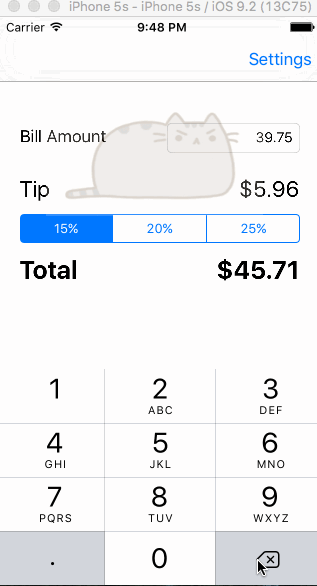

# Pre-work - *TipCalculator*

**TipCalculator** is a tip calculator application for iOS.

Submitted by: **Jennifer Kwan**

Time spent: **20** hours spent in total

## User Stories

The following **required** functionality is complete:

* [X] User can enter a bill amount, choose a tip percentage, and see the tip and total values.
* [X] Settings page to change the default tip percentage.

The following **optional** features are implemented:
* [X] UI animations
* [X] Remembering the bill amount across app restarts (if <10mins)
* [X] Using locale-specific currency and currency thousands separators.
* [X] Making sure the keyboard is always visible and the bill amount is always the first responder. This way the user doesn't have to tap anywhere to use this app. Just launch the app and start typing.

The following **additional** features are implemented:

- [X] List anything else that you can get done to improve the app functionality!
- I have added gifs for the UI animation.

## Video Walkthrough 

Here's a walkthrough of implemented user stories:

GIF created with [LiceCap](http://www.cockos.com/licecap/).

## Notes

Describe any challenges encountered while building the app.

The biggest challenge that I've encountered while building this app lied mainly in the coding part. I am a novice to coding and have encountered some trouble figuring out the logic. Most of the time spent building this app was on trying to get the required features to work properly through tweaking and rearranging the codes and the functions. 

## License

    Copyright [2015] [Jennifer Kwan]

    Licensed under the Apache License, Version 2.0 (the "License");
    you may not use this file except in compliance with the License.
    You may obtain a copy of the License at

        http://www.apache.org/licenses/LICENSE-2.0

    Unless required by applicable law or agreed to in writing, software
    distributed under the License is distributed on an "AS IS" BASIS,
    WITHOUT WARRANTIES OR CONDITIONS OF ANY KIND, either express or implied.
    See the License for the specific language governing permissions and
    limitations under the License.
